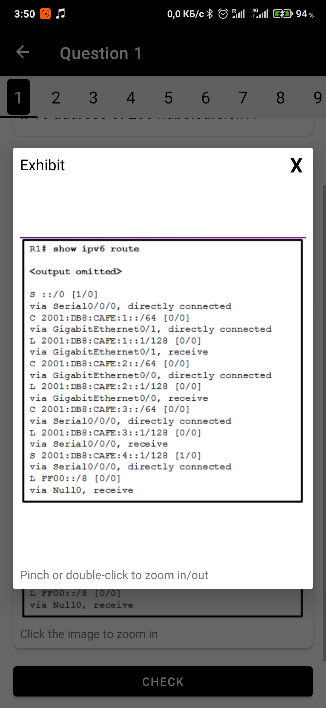
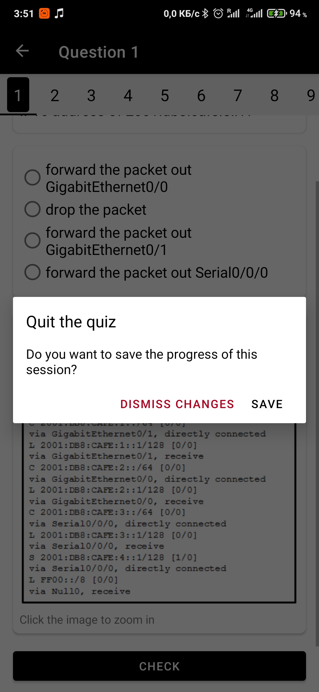

# CCNA Exams

This is an application that helps networking students to prepare for the CCNA exams.

## Used technologies

* MVVM Architecture + Repository pattern
* Navigation Component
* BottomNavigationView with 3 top-level destinations
* Single-activity application
* Koin for dependecy injection
* Firebase Firestore as a backend where the exams and questions are stored
* Caching is implemented for Firestore
* Retrofit + OkHttpClient to get the news from my API
* Caching is implemented for the API requests
* SwipeRefreshLayout for the News fragment
* ViewPager2 + TabLayout for the quiz presentation
* Custom TabLayout extension which dynamically sets the width of tab view so that 3-number string of 18sp size will fit there -> using reflection
* Custom tabView for TabLayout (green, red or black small material card as a background for the tab number)
* ROOM persistence library with full CRUD in order to save the quiz attempts, review completed quizzes, continue the previously started quizzes...
* TypeConverters to store custom objects in ROOM
* Glide to load images
* Custom ImageDialog which uses PhotoView library and creates a modal window with the image which can be zoomed in/out with pinch or double click gestures
* Custom ItemTouchHelper for History RecyclerView, which not only supports swipe-to-delete, but also draws a red delete background with white delete icon as a background of the swiped item
* Shared Element Transitions between ModeFragment and StartFragment
* Saving the quiz if the Activity is stopped
* Implemented instance state management with onSaveInstanceState (if a process with open quiz is killed in the background, after opening the app again the user will be able to continue from the same point)
* RecyclerView with 2 different ViewHolders selected based on the viewType
* RecyclerView with Fall Down layoutAnimation
* SharedPreferences
* Firebase Google Analytics
* Material design 2.0
* Google Admob interstitial ads

## Screenshots
    
    
    
    
    
  
